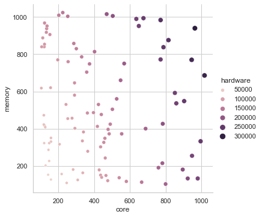
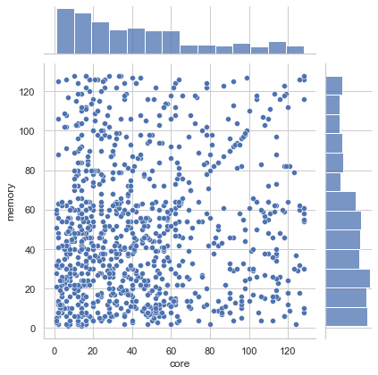
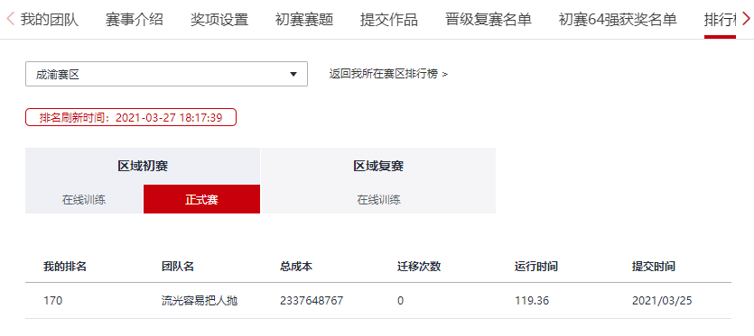

## [2021华为软件精英挑战赛](https://competition.huaweicloud.com/codecraft2021)

### 数据分析

看了`training-2.txt`的服务器和虚拟机的`core_num`、`memory_size`分布情况，但并没有想出什么好的优化策略。





### 成绩排名

渣渣算法，排名倒数，即使这样，还是记录一下吧，毕竟是付出辛劳写出来的

队友[lucheng2](https://github.com/lucheng2)



## 我的代码

### 第一版 schedule

#### 服务器初始化

服务器分成两种类型，一种只接收单节点虚拟机，另一种只接收双节点

```python
# 只接收双节点虚拟机
double_node_servers_distribute: Dict[int, Dict[int, List[int]]] = defaultdict(dict)
# 只接收单节点虚拟机
single_node_servers_distribute: Dict[int, Dict[int, List[int]]] = defaultdict(dict)
```

键值依次是`core_num`、`memory_size`，存放的是服务器的购买编号。

对于`double_node_servers`，A、B节点CPU和内存总量为它们的资源量，两个节点的资源分布总是相同的；对于`single_node_servers`，A、B节点中资源较大的一个为其资源量。

#### 处理虚拟机请求

有虚拟机请求来，在对应的`servers_distribute`里找满足资源需求且离它最近的服务器，距离的定义取欧拉距离，当然这里可以尝试其他的，试过曼哈顿距离，效果稍差一点。

找不到合适的就买新的服务器，在所提供的服务器中找满足资源需求且离它最近的，买下来，设定编号。

```python
# 实际的服务器和虚拟机
purchase_id_to_server: Dict[int, MyServer] = {}
id_to_virtual: Dict[str, MyVirtual] = {}
```

用字典来记录实际的服务器和虚拟机，方便查找。

接着做迁移，`servers_distribute`相应要变化，代码中`deploy_design`做记录。

#### 迁移策略

迁移是没有成本消耗的，但成本大头是在服务器上，应该买尽量少的服务器，这里优化不下来，就没考虑迁移了。

### 第二版 TaiJi

在第一版基础上改进。

服务器不再做区分，因为单、双节点的资源计算方式不同，还是分成了两个字典来记录。

```python
double_server_distribute: Dict[int, Dict[int, List[int]]] = defaultdict(dict)
single_server_distribute: Dict[int, Dict[int, List[tuple]]] = defaultdict(dict)
```

这个是成本最低的了，后面都是负优化了。

### 第三版 divide

定义了一个新东西，存核比，即内存大小和核数的比值。根据存核比把第一象限分成`num_part`个部分。

```python
market_server_baby_breath: List[Dict[int, Dict[int, List[str]]]] = []
double_baby_breath: List[Dict[int, Dict[int, Set[int]]]] = []
single_baby_breath: List[Dict[int, Dict[int, Set[tuple]]]] = []

num_part = 3  # 第一象限分成几部分
angle = np.linspace(0, np.pi/2, num_part + 1)[:-1]
slope = np.tan(angle)

for _ in range(num_part):
    double_baby_breath.append(defaultdict(dict))
    single_baby_breath.append(defaultdict(dict))
    market_server_baby_breath.append(defaultdict(dict))
```

在分配虚拟机时，去寻找存核比在同一范围内的服务器。

### 第四版 divide_accumulate

同一个存核比范围内，只买规格最高的服务器，这个是来乱写了。

之后想不出什么好方法，比赛就此打住，搞了一个星期放弃了。